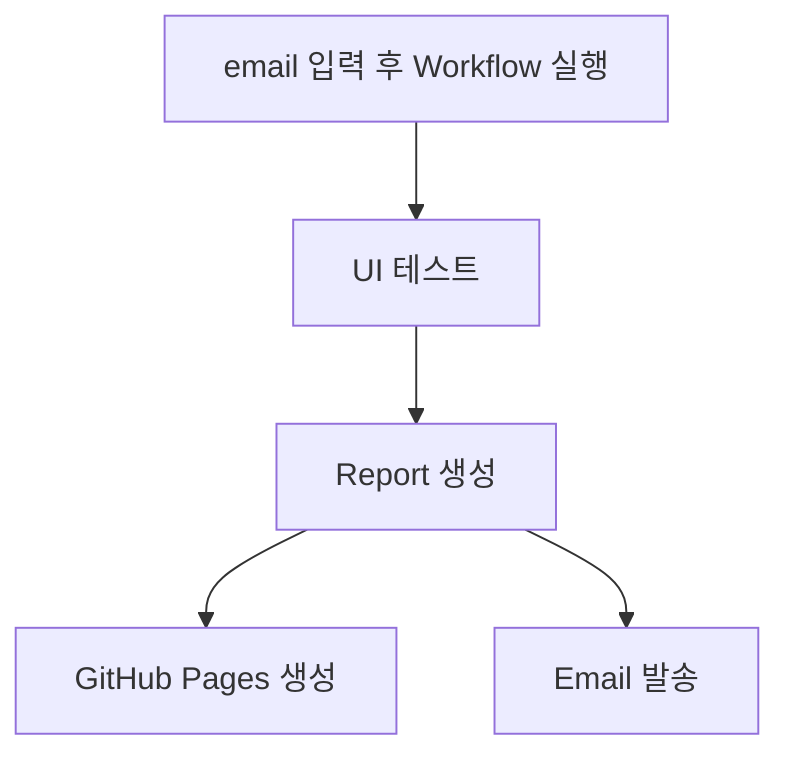
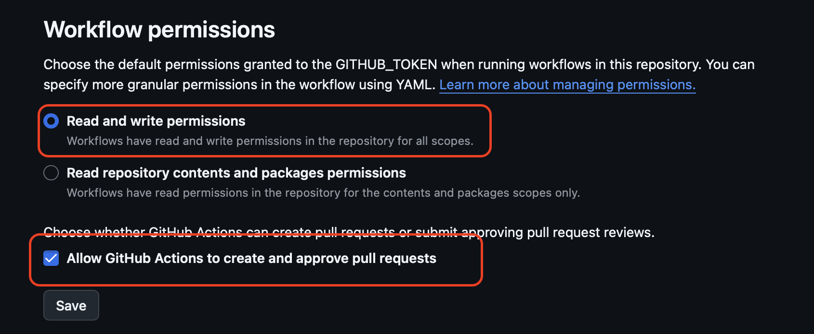
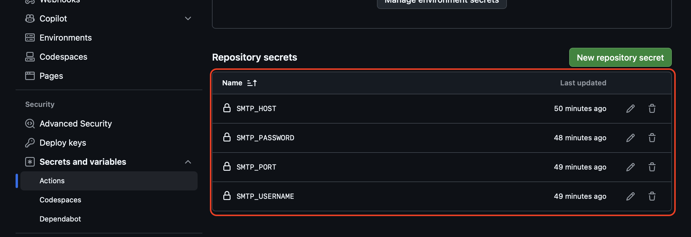

# Selenium Cucumber Sample project

이 프로젝트는 Selenium과 Cucumber를 사용한 UI 테스트 자동화 프로젝트입니다.  
테스트 실행 후, GitHub Pages에 리포트가 생성됩니다.

---

## GitHub Actions 사전 설정 (필수)

이메일 전송 기능과 workflow 실행을 위해, 먼저 리포지토리 설정을 확인해야 합니다

### Default Github repository setting
1. GitHub 리포지토리 → `Settings` 클릭
2. 좌측 메뉴에서 `Actions` → `General` 선택
3. 하단으로 스크롤 → **Workflow permissions** 섹션
4. 하단 설정 선택 및 체크
    - (●) **Read and write permissions**
    - [✓] **Allow GitHub Actions to create and approve pull requests**
5. **Save** 버튼 클릭
* 아래 사진이 정상적으로 나오지 않을 시에 소스코드 images/repository_setting.png 를 참고하시면 됩니다.

### Default Github email setting
1. GitHub 리포지토리 → `Settings` 클릭
2. 좌측 메뉴에서 `Secrets and variables` → `Action` 선택
3. `New repository secret` 클릭
   1. SMTP_HOST : email host address (ex > smtp.google.com)
   2. SMTP_PORT : smtp port (ex > 587)
   3. SMTP_USERNAME : email address(jhj2867@gmail.com)
   4. SMTP_PASSWORD : email password

* 아래 사진이 정상적으로 나오지 않을 시에 시에 소스코드 images/email_setting.png 를 참고하시면 됩니다.

> 반드시 이 설정을 완료해야 이메일 전송과 workflow 실행이 정상적으로 동작합니다.

---

## Github Action 실행 과정

1. `Repository` > `Action` tab 클릭
2. `Selenium Cucumber UI Test` 클릭
3. `Run workflow` 클릭
4. `Recipient email` 입력 (ex > user1@email.com)
   1. 여러사람에게 한번에 전송을 원하면 user1@email.com, user2@email.com 의 형식으로 입력하시면 가능합니다.
5. `Run workflow` 클릭

테스트 완료 email 에서 cucumber report 와 스크린샷 확인 가능합니다

---
## 소스코드 내부에서 수행하는 방법

1. /src/test/java/testRunner/TestRunner.java 진입
2. 우클릭 후 TestRunner.java 실행 클릭 (IntelliJ IDE 기준.)
3. /target/cucumber-report.html 에서 레포트 확인 가능합니다.

